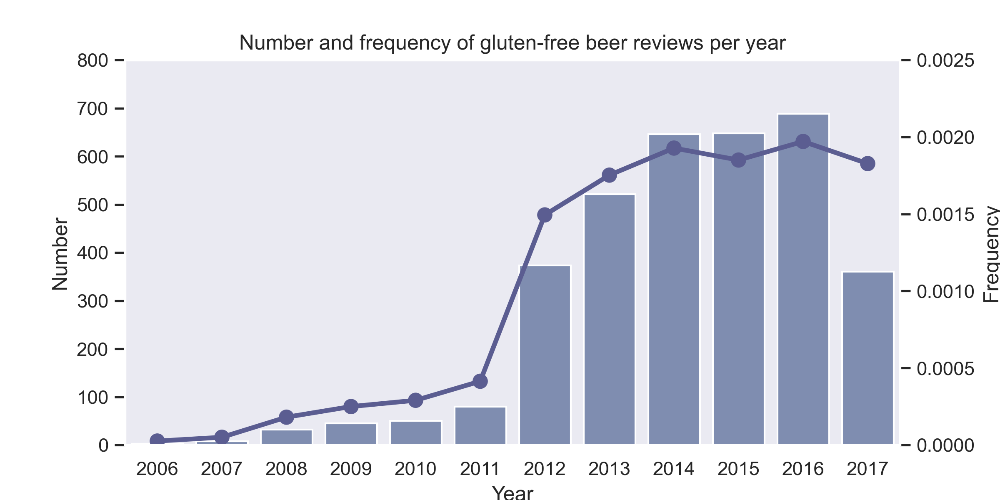
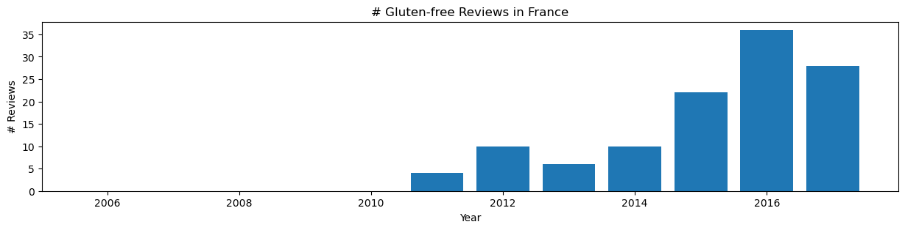
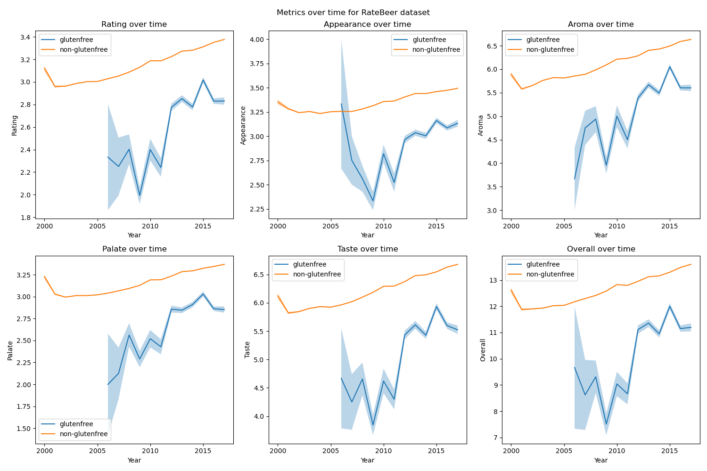
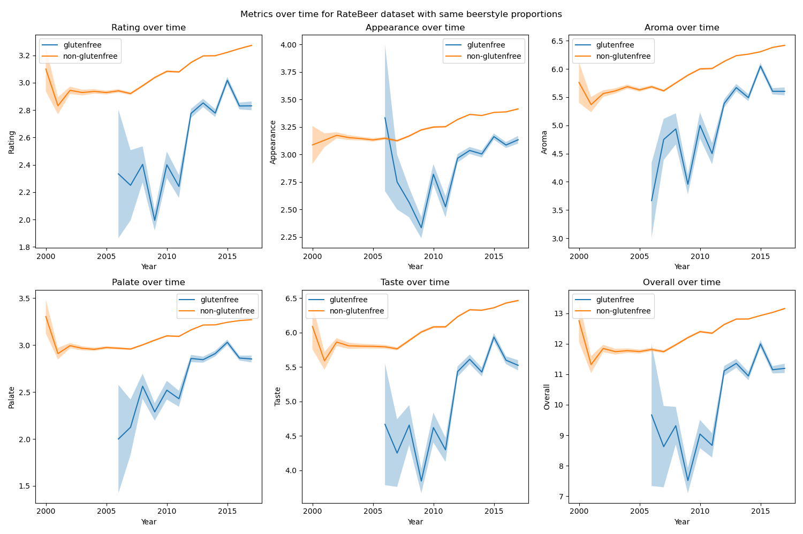
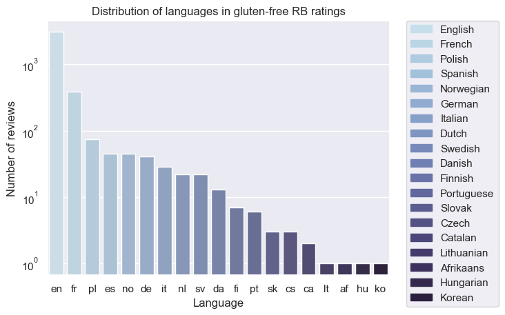

## Investigation Overview

Our adventure takes place during the 2010s, gluten-free food made a breakthrough in popularity and was much more available in general shops. Interestingly, in France and Belgium, people came up with stereotypes regarding gluten-free consumers and products, describing such a trend as a flash in a pan. One of those stereotypes is about the persona of gluten-free buyers, often described as urban snobbish people who want to distinguish themselves socially by consuming non-usual products, called "Bobo" in European French-speaking areas.

> The international Beer league (IBL) sent us, the renowned elite beer detectives to unveil the Bobos, study their characteristics and particularities, and determine if they are a threat to the International Beer Drinker Community (IBDC).

To investigate, the IBL has given us two sources of information: datasets from BeerAdvocate and RateBeer websites. Those contains reviews of numerous beers worldwide, including numerical ratings and written comments.

### The Bobo Footprint: Identifying the Spatiotemporal Distribution of Gluten-Free Beers

As seasoned detectives, and to start our quest, we need to gather all the information relevant to investigate the different aspects of gluten-free beers consumers, and hence whether they are any of those infamous "Bobo"s hidden amongst them.
**[actual text]: The first step to do such a things is to better know how gluten-free beers are consumed, both temporally and spatialy. This will be done in two steps:**
 _adapt?: We start by exploring the consumption of glutenfree beers temporally and spatially:_

- Step 1. Check the number of reviews given per year for gluten free beers globally.
- Step 2: Check the number of reviews given per year for gluten free beers as a function of the location.

Gluten-free beers are identified by containing "gluten" in their name. This is not the most effective way to find them, but the IBL did not seem to have a database indicating what beers are gluten-free. **This works however for beers from country speaking languages of European origin, as gluten is said "gluten" also in French, German, Dutch, Italian, and Spanish.**
**[actual text]**, _adapt?: gluten also in english, text could be: ..indicating what beers are gluten-free. This includes countries that speak French, German, Dutch, Italian(?), Spanish, and English. It might be that reviews are submitted in different languages than the country the reviewer is present in the very instant, but we have not enough information to map the geolocation of the users at the point of review, and hence will return this problem to the IBL for the future._
**These analyses will then be somewhat European-origin centered. Nevertheless, this is also the case for the databases kindly given by the IBL.**

This way, we have identified this many gluten-free beers (duplicates were removed from the total):

| Dataset | Gluten-free beers | Non-gluten-free beers |
| :------ |:--- | :--- |
| RateBeer | 213 | 396484 |
| BeerAdvocate | 121 | 211688 |
| Total | 313 | 592069 |

If we take a look at the ammount of reviews for gluten-free beers, we can see that it is clearly increasing. The datasets goes up to August 2017, which explains a lower amount of reviews for 2017.  However, seasoned detectives like us must always stay vigilant: is the reason for this increase because of the increase of the popularity of the websites? Or is it because of the increase of total number of reviews in the dataset? To look at that, we look at the proportion of total reviews that are made on gluten-free beers for each year.

With that we are sure: the increase of gluten-free beers reviews is not due to the increase of the total number of reviews in the dataset. The increase in other gluten-free products in early 2010's has then been translated into the beer-drinking world, assuming that the number of reviews is a good proxy to see the consumption of one product. This increase is especially impressive as the proportion of gluten-free triples in 2012! However, this proportion stays low, only reaching 0.2% at most.

But, where are they from? We now need to go to study the spatial distribution of the gluten-free beers drinker through their beer reviews.

Here we define `ratio` as the ratio of the number of reviews for glutenfree beers to the non-glutenfree beers. For each country, the ratio is a representative of **[actual text]: the "enrichment of glutenfree beer reviews"**, _adapt?: increase in number of glutenfree reviews (as the figure title changed)_ , reflecting the popularity of glutenfree beers in that country.

We then color the countries according to the ratio 'gluten-free/non-gluten-free', and visualize the absolute number of users and reviews for glutenfree beers with the human icon. An interactive map was made public for illustration:

<iframe src="https://jay4biopz.github.io/adarescueteam-beerquest/assets/html/gf_reviews_map.html" height="600px" width="100%" style="border:none;"></iframe>

The size of the human icon represents the number of users, but the size-scaling follows a cubic root function to avoid the dominance of large countries.
We can see that the ratio is the highest in France, reaching 0.66% of all reviews from France. This country is known to be the main home of bobos, with Belgium (ranked 3rd with 0.34%). On the American continent, in Canada the ratio is of 0.28% whereas in the US it is only 0.06%. From this, we can see that countries with high number of gluten-free reviews (e.g. Canada, Denmark, USA) are not always the ones with high gluten-free/non-gluten-free. 

| Country | Rank | Ratio | Gluten-free reviews number |
| :------ |:---- | :---- | :--------|
| France | 1 | 0.006610 | 116 |
| Latvia | 2 | 0.003757 | 10 |
| Belgium | 3 | 0.003385 | 100 |
| Canada | 9 | 0.002826 | 799 |
| Denmark | 17 | 0.001504 | 409 |
| USA | 41 | 0.000607 | 892 |

However, the spationtemporal analyis SPATIAL TEMPORAL ANALYSIS WITH FRANCE BELGIUM, CANADA AND USA

> Our investigation has encovered some characteristics of what we can call a gluten-free trend. It has exploded in 2012 but not equally in every-country. Some countries still were "highly" consuming gluten-free beers in 2017. Those countries happen to be the ones known to be home of "bobos". That might be a coincidence, or not, and require a deeper look before reporting to the IBL.  

### The Bobo Opinion: Decoding the Rating Conundrum

Most of the reviews posted for gluten-free beers are done by people who have reviewed "normal" beers too (98% of reviewers on gluten-free beers). Those reviewers are not gluten-intolerant and must be attracted to gluten-free beer for another reason, could it be the taste or quality of the beer? In the International Beer Drinker Community(IBDC) headquarters, corridor rumors say that gluten-free beers are generally worse than "normal" ones. Those rumors might be wrong then. To make this more clear, the IBDC ask clear views on the gluten-free reviews.

As the reviews metrics (rating, appearance, taste, aroma, palate, overall) are dependent of the dataset used, the RateBeer and BeerAdvocate dataset were analyzed independently. Only Ratebeer results are shown but similar ones were found for BeerAdvocate.

The first things we did to investigate this, was to look at all the reviews metrics throughout the years for both gluten-free and non-gluten-free beers.

Represented are the mean value of each review metrics +/- SEM per year. 
From this analysis, it seems that the gluten-free beers are worse from usual beers for all metrics considered. Although those metrics are increasing for gluten-free beers around 2011, when the gluten-free trend was starting for beers, they stay lower than usual beers. It is also interesting to see that those metrics also increase over time, more smoothly, for usual beers. Could the rumors spread in the IBDC HQs be true?

As reliable IBDC investigators, we think it is not clear yet. We saw that the beer style are very different between gluten-free beers and non-gluten-free ones. One type of beer could be more appreciate, more tasteful or have more aroma than another one. It is then possible that the beerstyle is a confounding factor in this analysis. To address this issue, the same analysis was done but with a subset of the RateBeer or BeerAdvocate dataset that has the same proportion of beerstyle than the gluten-free ratings.

No difference is visible between the ratings of the subset adjusted in beerstyle and the original one, then the difference between gluten-free and usual ratings cannot be explained by a change in the beerstyle. 

Our conclusion that we hereby send to the IBDC is that, indeed, gluten-free beers seem worse than usual beers on all metrics seen. However this can mean two things, that gluten-free beers are actually worse than normal beers, or that the ratings given  

> Yet, even though the numeric ratings are lower for gluten-free beers, their consumption increased and kept increasing in 2017 for some countries (France, Belgium). Could this be because people do not seek to drink a good and tastefull beer when trying a gluten-free one, but to distinguish themselves socially? This is one characteristic of the Bobo we are inquired to search for. This is even more intriguing as France and Belgium are the home of the locally famous "Bobo parisiens" and "Bobo bruxellois".

### The Bobo Blueprint: Crafting the Profile Puzzle with Textual Analysis

Through our great minds, we thought that a fancy word describing a gluten-free beer would be something like "floral", or "Herbal". Sure enough, we found these fancy words, among many others like "Metallic" to describe a gluten-free beers. Ha! The Bobos are not hiding as well as they thought they are!

Indeed, bobos distinguish themselves socially and culturally, by deploying words that are overly specific and fancy. So to examine whether they were present through our dataset, we need to ask these questions: 
Are there linguistic distinctions between individuals who consume gluten-free products and those who opt for conventional beer? Are there social and cultural differences reflected in the way gluten-free beer users express themselves compared to non-gluten-free beer users?

Hence, we start our textual analysis by a general EDA to detect the languages that are present in the dataset. 

We find that the most represented languages by the gluten-free drinkers are English and French. Assuming that Bobos like to hide among the gluten-free drinkers, this confirms our suspicion: the BOBOs are mostly present in France, Belgium, and maybe the US and Canada, this we are not sure, but must take into account as the most represented language in the dataset is English. 

But first, let us define a gluten-free user as someone who has rated at least one gluten-free beer.
Then, let us dub the potential Bobos that are present in USA and Canada as the "English-speaking Bobos", similarly, the "French-speaking Bobos" would be those present in France and Belgium.
With that, we have all that we need. We can then proceed to ask ourselves: are the English-speaking Bobos different from their French accolytes?

Hence, we divide our textual analysis into two parts: The first analyses the French-speaking Bobos, and the second analyses the English-speaking Bobos. 

We decided to only focus on adjective and adverbs in the dataset as they are more representative of the Beer reviews, and the users who write them. after processing steps, we were able to cluster the users based on the vocabulary they used in their reviews. 

We found that one of the clusters had a proportion of more than 80% of reviewers who share similar linguistic characteristic, which very heavily pointed towards gluten-free users.

This analysis however served to prove the differences between gluten-free and non-gluten-free users, but was not at all sufficient to identify the Bobos inside the gluten-free reviewers.

That is why we needed to go deeper in the analysis of the vocabulary. We established a logistic classifier predicting whether or not a person is q glutenfree user or not bqsed on the adjectives and adverb he use. We then analysed the features that most effectively predict if someome is a glutenfree user or not. the features that best oredict the ratings from glutenfree consumers.these words could be present in glutenfree users and conventional beers users but with counts with large variability.In this word, some of them are very common used but someone such as metal are very close to the first word that we think are related with BOBO. A second analysis about words that are only used by glutenfree user has been performed, and we get similar accuracy of the model. 

we design qa claassifier to detect paragraphs from bobo.

To further follow this lead, we asked ourselves if the gluten-free consumers exhibit specific linguistic characteristics? Or is this vocabulary just usually used only for describing the gluten-free beers?

To answer this question, we will define glutenfree users as consumers that have rated more than one glutenfree beers.

### Conclusion

to be continued
