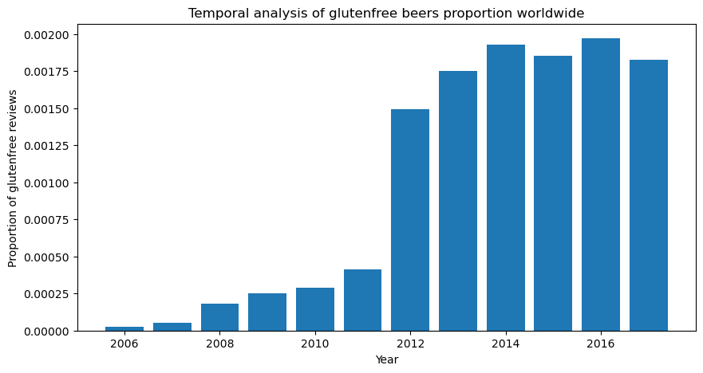

## Investigation Overview

Our adventure takes place during the 2010s, gluten-free food made a breakthrough in popularity and was much more available in general shops. Interestingly, in France and Belgium, people came up with stereotypes regarding gluten-free consumers and products, describing such a trend as a flash in a pan. One of those stereotypes is about the persona of gluten-free buyers, often described as urban snobbish people who want to distinguish themselves socially by consuming non-usual products, called "Bobo" in European French-speaking areas.

> The international Beer league sent us, the renowned elite beer detectives to unveil the Bobos, study their characteristics and particularities, and determine if they are a threat to the International Beer Drinker Community (IBDC).

# Get ready for the Quest

As seasoned detectives, and to start our quest, we first need to gather all the information relevant to find the Bobos. That is why we start with the EDA.

We find that the most represented languages by the BOBOs are English and French. This confirms our suspicion: the BOBOs are mostly present in France, Belgium, and maybe the US and Canada, this we are not sure, but must take into account as the most represented language in the dataset is English.

> For our quest, and to more easily highlight the Bobos, we need to detect what they have to say on the Beers. This basically implies that we need to analyse the beer reviews.

We start our textual analysis by a general EDA to detect the languages that are present in the dataset. Hence we start! 

<iframe src="https://jay4biopz.github.io/adarescueteam-beerquest/assets/html/beer_styles.html" height="800px" width="100%" style="border:none;"></iframe>

### The Bobo Footprint: Identifying the Spatiotemporal Distribution of Gluten Free Beers

We needed to study the temporal activity of the Bobos to see if they were plotting something shady. For that, our temporal analysis will be done in two steps.

- Step 1. Checking the number of reviews per year for gluten free beers globally.
- Step 2: Checking the number of reviews per year for gluten free beers as a function of the location.

This plot clearly shows that the ammount of reviews for gluten-free beers is increasing. However, seasoned detectives like us must always stay vigilant: is the reason for this increase because of the increase of the popularity of the site? Or is it because of the increase of total number of reviews in the dataset?

With that we are sure: the increase of gluten-free beers reviews is not due to the increase of the total number of reviews in the dataset. There can only be one explanation for that: the Bobos are clearly more and more present, globally.

But, where are they? We now need to go to study the spatial distribution of the Bobos through their beer reviews.

Here we define `ratio` as the ratio of the number of reviews for glutenfree beers to the non-glutenfree beers. For each country, the ratio is a representative of the "enrichment of glutenfree beer reviews", reflecting the popularity of glutenfree beers in that country.

We then color the countries according to the ratio, and visualize the absolute number of users and reviews for glutenfree beers at the same time. This step was done using an interactive map.

<iframe src="https://jay4biopz.github.io/adarescueteam-beerquest/assets/html/gf_reviews_map.html" height="600px" width="100%" style="border:none;"></iframe>

The size of the human icon represents the number of users, but the size-scaling follows a cubic root function to avoid the dominance of large countries.

> Until now, our investigation pointed us towards some specific countries that we think most likely contain the Bobos Heaquarters: France, Belgium, Canada and the United States of America. Thus, it would be interesting to see the temporal evolution of gf reviews specifically in these countries.

### The Bobo Opinion: Decoding the Rating Conundrum

Most of the reviews posted for gluten-free beers are done by people who have reviewed "normal" beers too (% of reviewer?). Those reviewers are not gluten-intolerant and must be attracted to gluten-free beer for another reason, could it be the taste or quality of the beer? In the International Beer Drinker Community(IBDC) headquarters, corridor rumors say that gluten-free beers are generally worse than "normal" ones. Those rumors might be wrong then. To make this more clear, the IBDC ask clear views on the gluten-free reviews.

As the reviews metrics (rating, appearance, taste, aroma, palate, overall) are dependent of the dataset used, the RateBeer and BeerAdvocate dataset were analyzed independently. Only Ratebeer results are shown but similar ones were found for BeerAdvocate.

The first things we did to investigate this, was to look at all the reviews metrics throughout the years for both gluten-free and non-gluten-free beers.

Represented are the mean value of each review metrics +/- SEM per year. 
From this analysis, it seems that the gluten-free beers are worse from usual beers for all metrics considered. Although those metrics are increasing for gluten-free beers around 2011, when the gluten-free trend was starting for beers, they stay lower than usual beers. It is also interesting to see that those metrics also increase over time, more smoothly, for usual beers. Could the rumors spread in the IBDC HQs be true?

As reliable IBDC investigators, we think it is not clear yet. We saw that the beer style are very different between gluten-free beers and non-gluten-free ones. One type of beer could be more appreciate, more tasteful or have more aroma than another one. It is then possible that the beerstyle is a confounding factor in this analysis. To address this issue, the same analysis was done but with a subset of the RateBeer or BeerAdvocate dataset that has the same proportion of beerstyle than the gluten-free ratings.

No difference is visible between the ratings of the subset adjusted in beerstyle and the original one, then the difference between gluten-free and usual ratings cannot be explained by a change in the beerstyle. 

Our conclusion that we hereby send to the IBDC is that, indeed, gluten-free beers seem worse than usual beers on all metrics seen. However this can mean two things, that gluten-free beers are actually worse than normal beers, or that the ratings given  

> Yet, even though the numeric ratings are lower for gluten-free beers, their consumption increased and kept increasing in 2017 for some countries (France, Belgium). Could this be because people do not seek to drink a good and tastefull beer when trying a gluten-free one, but to distinguish themselves socially? This is one characteristic of the Bobo we are inquired to search for. This is even more intriguing as France and Belgium are the home of the locally famous "Bobo parisiens" and "Bobo bruxellois".

### The Bobo Blueprint: Crafting the Profile Puzzle with Textual Analysis

to be continued

### Conclusion

to be continued
