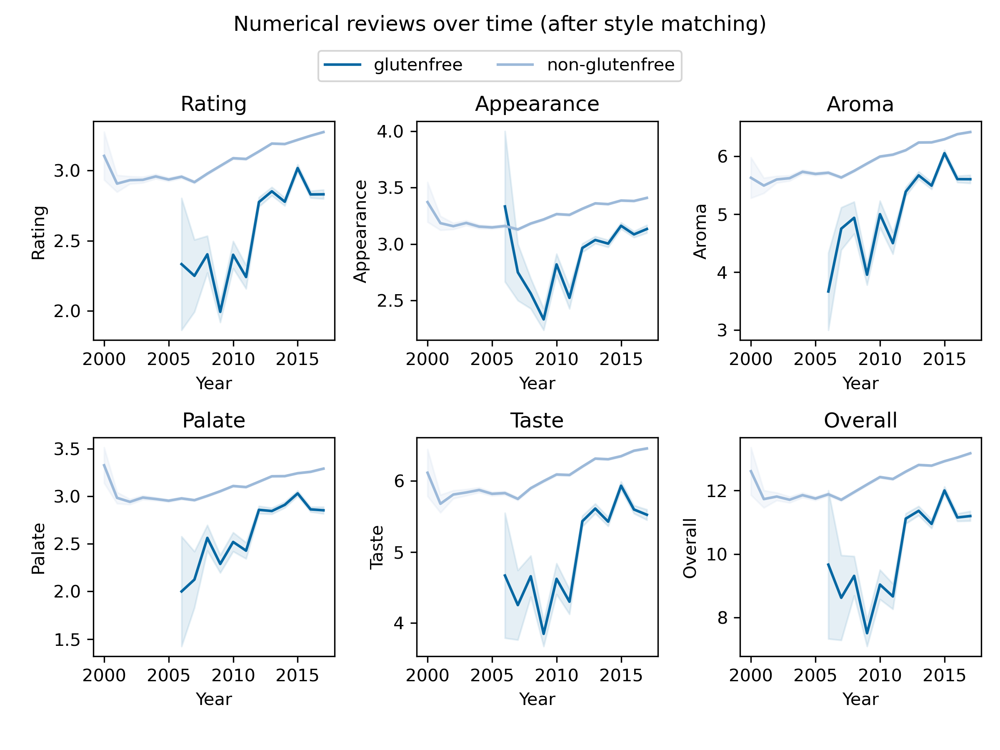

## Investigation Overview

Our adventure takes place during the 2010s, glutenfree food made a breakthrough in popularity and was much more available in general shops. Interestingly, in France and Belgium, people came up with stereotypes regarding glutenfree consumers and products, describing such a trend as a flash in a pan. One of those stereotypes is about the persona of gluten-free buyers, often described as urban snobbish people who want to distinguish themselves socially by consuming non-usual products, called "Bobo" in European French-speaking areas.

> The International Beer League (IBL) sent us, the renowned elite beer detectives to unveil the Bobos, study their characteristics and particularities, and determine if they are a threat to the International Beer Drinker Community (IBDC).

To investigate, the IBL has given us two sources of information: datasets from BeerAdvocate and RateBeer websites. Those contain reviews of numerous beers worldwide, including numerical ratings and written comments.

### The Bobo Footprint: Identifying the Spatiotemporal Distribution of Glutenfree Beers

As seasoned detectives, to start our quest, we need to gather all the information relevant to investigate the different aspects of glutenfree beer consumers, and hence whether they are any of those infamous "Bobo"s hidden amongst them.

Glutenfree beers are identified by containing "gluten" in their name. This is not the most effective way to find them, but the IBL did not seem to have a database indicating what beers are glutenfree. This works however for beers from countries speaking languages of European origin, as gluten is said "gluten" in French, German, Dutch, and Spanish, but not Italian. These analyses will then be somewhat European-origin-centered. Nevertheless, this is also the case for the databases kindly given by the IBL.

This way, we have identified this number of glutenfree beers (duplicates were removed from the total):

  <table>
    <tr>
      <th>Dataset</th>
      <th>Glutenfree beers</th>
      <th>Non-glutenfree beers</th>
    </tr>
    <tr>
      <td>RateBeer</td>
      <td>213</td>
      <td>396484</td>
    </tr>
    <tr>
      <td>BeerAdvocate</td>
      <td>121</td>
      <td>211688</td>
    </tr>
    <tr>
      <td>Total</td>
      <td>313</td>
      <td>592069</td>
    </tr>
  </table>

Now that we know glutenfree beers, we can start looking at how they are consumed, this is done in two steps:

- Step 1. Analyze the number of reviews given per year for glutenfree beers globally.
- Step 2: Analyze the number of reviews given per year for glutenfree beers as a function of the location.

If we take a look at the amount of reviews for glutenfree beers, we can see that it is clearly increasing. The dataset goes up to August 2017, which explains a lower amount of reviews for 2017.  However, seasoned detectives like us must always stay vigilant: is the reason for this increase because of the increase in the popularity of the websites? Or is it because of the increase in the total number of reviews in the dataset? To look at that, we look at the proportion of total reviews that are made on glutenfree beers for each year. With that we are sure: the increase of glutenfree beer reviews is not due to the increase of the total number of reviews in the dataset. The increase in other glutenfree products in the early 2010s has then been translated into the beer-drinking world, assuming that the number of reviews is a good proxy to see the consumption of one product. This increase is especially impressive as the proportion of glutenfree tripled in 2012! However, this proportion stays low, only reaching 0.2% at most.

But, where are those reviews from? We now need to investigate the spatial distribution of the glutenfree beer drinkers through their beer reviews.

Here we define `ratio` as the ratio of the number of reviews for glutenfree beers to the non-glutenfree beers. For each country, the ratio is representative of how much present are gluten-free reviews among the total reviews, reflecting the popularity of glutenfree beers in that country.

We then color the countries according to the ratio 'glutenfree/non-glutenfree', and visualize the absolute number of users and reviews for glutenfree beers with the human icon. An interactive map was made public for illustration:

<iframe src="https://jay4biopz.github.io/adarescueteam-beerquest/assets/html/gf_reviews_map.html" height="600px" width="100%" style="border:none;"></iframe>

The size of the human icon represents the number of users, but the size-scaling follows a cubic root function to avoid the dominance of large countries. Moreover, French Guiana and Corsica are associated with the French region, but they are only minorly represented in the dataset of the reviews. They appear on the map due to a limitation of our analyzing tools. Nevertheless, there are only two English reviews in the dataset that are associated with French Guiana and none from Corsica, and thus do not influence the following analysis.
We can see that the ratio is the highest in France, reaching 0.66% of all reviews from France, which is the country known to be the main home of Bobos, along with Belgium (ranked 3rd with 0.34%). On the American continent, in Canada, the ratio is 0.28% whereas in the US it is only 0.06%. From this, we can see that countries with a high number of gluten-free reviews (e.g. Canada, Denmark, USA) are not always the ones with high glutenfree/non-glutenfree.

  <table>
    <tr>
      <th>Country</th>
      <th>Rank</th>
      <th>Ratio</th>
      <th>Glutenfree reviews number</th>
    </tr>
    <tr>
      <td>France</td>
      <td>1</td>
      <td>0.006610</td>
      <td>116</td>
    </tr>
    <tr>
      <td>Latvia</td>
      <td>2</td>
      <td>0.003757</td>
      <td>10</td>
    </tr>
    <tr>
      <td>Belgium</td>
      <td>3</td>
      <td>0.003385</td>
      <td>100</td>
    </tr>
    <tr>
      <td>Canada</td>
      <td>9</td>
      <td>0.002826</td>
      <td>799</td>
    </tr>
    <tr>
      <td>Denmark</td>
      <td>17</td>
      <td>0.001504</td>
      <td>409</td>
    </tr>
    <tr>
      <td>USA</td>
      <td>41</td>
      <td>0.000607</td>
      <td>892</td>
    </tr>
  </table>

However, if we dive into the evolution of the number of glutenfree reviews per country, we can see that different dynamics occur. For the USA, there was a big boom in glutenfree beers in 2012, which then fell from 2014. Seeing this, we could say that there was a **trend** of glutenfree consumption in the US, that then passed away as trends do. This is not the case for Canada, which we could think of as close culturally to the USA, where a first boom in 2012 was supplied by another increase in 2014 and 2015, and then decreased immensely after. In Europe, for Belgium, this increase occurred in 2013 and stayed relatively constant, even though a second increase in 2015 could be seen. In Denmark, two waves occurred in 2013 and 2016, with an important decrease in between. Even though Denmark has a much higher number of glutenfree reviews than Belgium, it is worth remembering that their glutenfree/non-glutenfree ratio is low (a quarter of French one and half of the Belgian one). In France, the dynamic is a bit different, as the first wave of glutenfree in 2012 was very dim, and glutenfree consumption increased year-by-year from 2013. This dynamic is then very country-specific, however, most top-performing countries ratio-wise have a low number of glutenfree reviews (e.g. Latvia) that don't enable a precise analysis. We summarize these findings in the following interactive figure.

<iframe src="https://jay4biopz.github.io/adarescueteam-beerquest/assets/html/spatiotemporal_line_curve.html" height="400px" width="100%" style="border:none;"></iframe>

Then we can see two main dynamics here: one with one or two big booms in consumption that then decrease a lot, and another one that is more long-lasting and less subject to those booms. This first dynamic can be called a peak trend, changing rapidly, whereas the second one must be driven by longer dynamics, such as the adoption of this kind of beer by a specific social group. However, as this rise in gluten-free reviews is still quite new, especially in France, we advise the IBL to continue monitoring these glutenfree dynamics.

It is important to note that 98% of the people who reviewed glutenfree beers also reviewed beers containing gluten, so do not have to drink glutenfree beers for health reasons (or are not strictly prohibiting gluten in their diet). This number is quite surprising but could be explained because people who have to follow a glutenfree diet are not used to beer-drinking and so would less comment on websites such as BeerAdvocate or RateBeer.

> Our investigation has uncovered some characteristics of what we can call a glutenfree trend. It has exploded in 2012 but not equally in every country. Some countries still were "highly" consuming glutenfree beers in 2017. Those countries happen to be the ones known to be home to "bobos", which is our original suspicion. However, that might also be a coincidence, and so it is required to take a deeper look before reporting to the IBL.  

### The Bobo Opinion: Decoding the Rating Conundrum

Most of the reviews posted for glutenfree beers are done by people who have reviewed "normal" beers too. Thus, those reviewers are not gluten-intolerant and must be attracted to glutenfree beer for another reason. Could that reason be a better taste or a better quality of the glutenfree beer? In the International Beer League(IBL) headquarters, corridor rumors say that glutenfree beers are generally worse than "normal" ones. Those rumors might be wrong then. To make this clearer, the IBL asks us to give a clearer view on the glutenfree reviews.

As the review metrics (rating, appearance, taste, aroma, palate, overall) are dependent on the dataset used, the RateBeer and BeerAdvocate datasets were analyzed independently. Only Ratebeer results are shown but similar ones were found for BeerAdvocate.

To investigate this, the first thing we did was to look at all the review metrics throughout the years for both glutenfree and non-glutenfree beers in the RateBeer dataset. We note that each rating scale is ranging from a minimum of 1 to a maximum of 10 except for the overall rating, where the minimum is also 1 but the maximum is 20. 

Represented are the mean value of each review metric +/- SEM per year. 
From this analysis, it seems that the glutenfree beers are worse than usual beers for all metrics considered. Although those metrics were increasing for glutenfree beers around 2011, when the glutenfree trend was starting for beers, they stayed lower than usual beers. It is also interesting to see that those metrics also increase over time, more smoothly, for usual beers. Could the rumors spread in the IBDC HQs be true?

As reliable IBDC investigators, we think it is not clear yet. We saw that the beer styles are very different between glutenfree beers and non-glutenfree ones. One type of beer could be more appreciated, more tasteful, or have more aroma than another one. It is then possible that the beer style is a confounding factor in this analysis. 

We put the frame for the new data around the following beer styles:

<iframe id="myIframe" src="https://jay4biopz.github.io/adarescueteam-beerquest/assets/html/beer_styles.html" width="100%" height="600px" style="border:none;"></iframe>

Now we can address the issue mentioned beforehand, and repeat the same analysis with a subsetted RateBeer dataset that contains the same beerstyle as the glutenfree ratings.

No difference is visible between the ratings of the subset adjusted in beer style and the original one. We can thus conclude that the difference between glutenfree and conventional beer ratings cannot be explained by a change in the beer style. 

The ratings given to glutenfree beers do seem to be lower than the ones for usual beers. There could however be two explanations for this. The first and obvious one is that the glutenfree beers would actually be worse than "normal" beers. Verifying this would require the IBL to send beer experts to objectively rate glutenfree beers. However, beer experts cost a lot of money and, given its political landscape, the IBL does not seem to finance science this much. The second explanation would be that people would have heard the same rumors as the one spreading among the IBL, and would have a made-up mind about glutenfree beers. People would then be harsher in the reviews.

Conducting sentiment analysis on both French and English written reviews, we aimed to determine if reviews aligned with ratings. We hypothesize that we would see way more negative reviews based on the rumors that are momentarily in circulation. Yet, we must bear in mind that bias could persist in this analysis too. The plot unveiled intriguing findings: the sentiment score mirrors the appearance trend, while the overall numerical reviews seem to diverge from the textual sentiment.

> Yet, even though the numeric ratings are lower for glutenfree beers, we observe that for some countries (France, Belgium), their consumption increased and kept increasing in 2017. Could this be because people do not seek to drink a good and tasteful beer when trying a glutenfree one, but to distinguish themselves socially? This is actually a characteristic of the "Bobo"s, even more intriguing as France and Belgium are the home of the locally famous "Bobo parisiens" and "Bobo bruxellois".

Our conclusion, directed to the IBDC, asserts that glutenfree beers indeed exhibit lower performance across all metrics compared to regular beers. However, this trend does not correlate with the overall rising numerical ratings. Notably, the sentiment graph for glutenfree beers shares similarities with their appearance aspect. We suspect an initial product hype followed by a wave of negative ratings—perhaps stemming from initial optimism and in the following years revealing the true taste value. Around 2012, there seems to be a resurgence in the number of reviews and thus the consumption of glutenfree beers. This reinforces our suspicion regarding the "Bobo"s recent activities!

### The Bobo Blueprint: Crafting the Bobo Profile Puzzle through Textual Analysis

Through our great minds, we thought that a fancy word describing a glutenfree beer would be something like "floral", or "Herbal". Sure enough, we found these fancy words, among many others like "Metallic" to describe a glutenfree beers. Ha! The Bobos are not hiding as well as they thought they were!

Indeed, "Bobo"s distinguish themselves socially and culturally, by deploying words that are overly specific and fancy. So to examine whether they were present through our dataset, we need to ask these questions: 
Are there linguistic distinctions between individuals who consume glutenfree products and those who opt for conventional beer? Are there social and cultural differences reflected in the way glutenfree beer users express themselves compared to non-glutenfree beer users?

Thus, let's explore the distribution of the languages that can be found in the glutenfree review dataset:_

We find that the most represented languages by the glutenfree drinkers are English and French. Assuming that Bobos like to hide among glutenfree drinkers, this confirms our suspicion: the "Bobo"s are mostly present in France, Belgium, and maybe the US and Canada, which we can only assume, but we need to take it into account as English is the most represented language. 

First, we define a glutenfree user as someone who has rated at least one glutenfree beer and dub the potential "Bobo"s that are present in USA and Canada as the 'English-speaking "Bobo"s', and in France and Belgium as the 'French-speaking "Bobo"s'. We want to answer the question: Are there differences between 'English-speaking "Bobo"s' and their fellow 'French-speaking "Bobo"s'?

As we aim to cluster the words used by the two groups, our focus lies on analyzing the frequency of adverbs and adjectives—shedding light on the users' semantics within beer reviews. This detective work seeks to unravel a clearer understanding of the users and the nuances they share, or that distinguish them.

We plotted the T-SNE map of glutenfree users and conventional beer users. 

We find two things. First, the former overlaps just a little with the latter, which means that the glutenfree users only share a linguistic similarity with a small proportion of the conventional beer users. Second, that the glutenfree users are very close to each other linguistically.

As the t-SNE axes are not directly interpretable, we wanted to use the text data to better characterize the differences between a glutenfree and a conventional user. That is why we needed to go deeper in the analysis of the vocabulary that each of the two uses. Enter our guiding light: ‘El Logressor’ (a logistic regression classifier), our hope in unraveling this mystery. 
Indeed, El Logressor is a logistic classifier that predicts whether or not a person is a glutenfree user based on the adjectives and adverbs he uses. 

El Logressor proved to be a formidable weapon: with a remarkable accuracy of 94%, it was able to distinguish between the glutenfree and conventional users.  
However, it can not distinguish between the "Bobo"s and the "non-Bobo"s amongst the glutenfree users. 

As our investigation zeroed in on a cohort possibly standing out amidst the realm of glutenfree consumers, our certainty grew—we sensed we were threading the right path. Our findings highlighted a captivating set of users, yet the enigmatic "Bobo"s remained evasive, slipping beyond our reach. That is why we needed to go deeper in the analysis of the vocabulary, separating the glutenfree users' vocabulary from the conventional beer users to better highlight the glutenfree users. This would then enable us to see if there is Bobo's amongst the glutenfree users. 

Enter our second guiding light: the glutenfree bag of words.
In fact, this 'BoW' contains words that were only used by glutenfree users in their reviews.

We then analysed their fanciness by asking our Special agent Chatgpt to rank the fanciness of each word in that BoW.

Our analysis shows that glutenfree users and conventional beer users have different linguistics particularities. However, it seems that glutenfree users are not really 'BOBO' in the sense that the specific adjectives and adverbs that glutenfree users employed are not really fancy. Some of them are not very common such as the French word 'remous', or the word 'gibbous' in English, but not necessarily fancy. The main difficulty we face here is to have an objective metric to describe fanciness. 

### Conclusion
To conclude, we present our final report to the IBL:

Indeed, we have seen that glutenfree beers are less appreciated than conventional beers. This leads us to investigate why glutenfree beer drinkers continue to drink them. We found that these consumers mostly are not allergic to gluten since they consume also conventional beers. So we investigated what drives them to drink glutenfree beers. We hypothesized that these persons were the "BOBO"s, who drink glutenfree beers to distinguish themselves from other people in the society. To assess if glutenfree users were indeed BOBO, we made a text analysis to evaluate the fanciness of the vocabulary used by glutenfree users.

Finally, we did find a particularity of glutenfree users compared to their conventional counterparts in aspects of linguistic usage. We need further investigation to shed light on "Bobo"s comprehensive profile and the causality between them and glutenfree beers.
