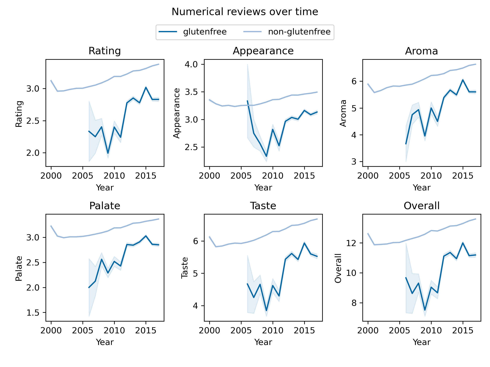

## Investigation Overview

Our adventure takes place during the 2010s, gluten-free food made a breakthrough in popularity and was much more available in general shops. Interestingly, in France and Belgium, people came up with stereotypes regarding gluten-free consumers and products, describing such a trend as a flash in a pan. One of those stereotypes is about the persona of gluten-free buyers, often described as urban snobbish people who want to distinguish themselves socially by consuming non-usual products, called "Bobo" in European French-speaking areas.

> The international Beer league (IBL) sent us, the renowned elite beer detectives to unveil the Bobos, study their characteristics and particularities, and determine if they are a threat to the International Beer Drinker Community (IBDC).

To investigate, the IBL has given us two sources of information: datasets from BeerAdvocate and RateBeer websites. Those contains reviews of numerous beers worldwide, including numerical ratings and written comments.

### The Bobo Footprint: Identifying the Spatiotemporal Distribution of Gluten-Free Beers

As seasoned detectives, and to start our quest, we need to gather all the information relevant to investigate the different aspects of gluten-free beers consumers, and hence whether they are any of those infamous "Bobo"s hidden amongst them.

Gluten-free beers are identified by containing "gluten" in their name. This is not the most effective way to find them, but the IBL did not seem to have a database indicating what beers are gluten-free. This works however for beers from country speaking languages of European origin, as gluten is said "gluten" in French, German, Dutch, and Spanish, but not Italian. These analyses will then be somewhat European-origin centered. Nevertheless, this is also the case for the databases kindly given by the IBL.

This way, we have identified this number of gluten-free beers (duplicates were removed from the total):

  <table>
    <tr>
      <th>Dataset</th>
      <th>Gluten-free beers</th>
      <th>Non-gluten-free beers</th>
    </tr>
    <tr>
      <td>RateBeer</td>
      <td>213</td>
      <td>396484</td>
    </tr>
    <tr>
      <td>BeerAdvocate</td>
      <td>121</td>
      <td>211688</td>
    </tr>
    <tr>
      <td>Total</td>
      <td>313</td>
      <td>592069</td>
    </tr>
  </table>

Now that we know gluten-free beers, we can start looking at how they are consummed, this is done in two step:

- Step 1. Analyze the number of reviews given per year for gluten free beers globally.
- Step 2: Analyze the number of reviews given per year for gluten free beers as a function of the location.

If we take a look at the amount of reviews for gluten-free beers, we can see that it is clearly increasing. The datasets goes up to August 2017, which explains a lower amount of reviews for 2017.  However, seasoned detectives like us must always stay vigilant: is the reason for this increase because of the increase of the popularity of the websites? Or is it because of the increase of total number of reviews in the dataset? To look at that, we look at the proportion of total reviews that are made on gluten-free beers for each year. With that we are sure: the increase of gluten-free beers reviews is not due to the increase of the total number of reviews in the dataset. The increase in other gluten-free products in early 2010's has then been translated into the beer-drinking world, assuming that the number of reviews is a good proxy to see the consumption of one product. This increase is especially impressive as the proportion of gluten-free triples in 2012! However, this proportion stays low, only reaching 0.2% at most.

But, where are those reviews from? We now need to go to investigate the spatial distribution of the gluten-free beers drinker through their beer reviews.

Here we define `ratio` as the ratio of the number of reviews for glutenfree beers to the non-glutenfree beers. For each country, the ratio is a representative of how much present are gluten-free reviews among the total reviews, reflecting the popularity of glutenfree beers in that country.

We then color the countries according to the ratio 'gluten-free/non-gluten-free', and visualize the absolute number of users and reviews for glutenfree beers with the human icon. An interactive map was made public for illustration:

<iframe src="https://jay4biopz.github.io/adarescueteam-beerquest/assets/html/gf_reviews_map.html" height="600px" width="100%" style="border:none;"></iframe>

The size of the human icon represents the number of users, but the size-scaling follows a cubic root function to avoid the dominance of large countries.
We can see that the ratio is the highest in France, reaching 0.66% of all reviews from France. This country is known to be the main home of bobos, with Belgium (ranked 3rd with 0.34%). On the American continent, in Canada the ratio is of 0.28% whereas in the US it is only 0.06%. From this, we can see that countries with high number of gluten-free reviews (e.g. Canada, Denmark, USA) are not always the ones with high gluten-free/non-gluten-free.

  <table>
    <tr>
      <th>Country</th>
      <th>Rank</th>
      <th>Ratio</th>
      <th>Gluten-free reviews number</th>
    </tr>
    <tr>
      <td>France</td>
      <td>1</td>
      <td>0.006610</td>
      <td>116</td>
    </tr>
    <tr>
      <td>Latvia</td>
      <td>2</td>
      <td>0.003757</td>
      <td>10</td>
    </tr>
    <tr>
      <td>Belgium</td>
      <td>3</td>
      <td>0.003385</td>
      <td>100</td>
    </tr>
    <tr>
      <td>Canada</td>
      <td>9</td>
      <td>0.002826</td>
      <td>799</td>
    </tr>
    <tr>
      <td>Denmark</td>
      <td>17</td>
      <td>0.001504</td>
      <td>409</td>
    </tr>
    <tr>
      <td>USA</td>
      <td>41</td>
      <td>0.000607</td>
      <td>892</td>
    </tr>
  </table>

However, if we dive into the evolution of the number of gluten-free reviews per country, we can see that different dynamics occur. For the USA, there was a big boom of gluten-free beers in 2012, that then fell down from 2014. Seeing this, we could say that there was a **trend** of gluten-free consumption in the US, that then passed aways as trends do. This is not the case for Canada, that we could think as close culturally to the USA, were a first boom in 2012 was supplied by another increase in 2014 and 2015, and then decreasing immensely after. In Europe, for Belgium, this increase occured in 2013 and stayed relatively constant, even thoug a second increase in 2015 could be seen. In denmark, two waves occured in 2013 and 2016, with an important decrease inbetween. Even though Denmark has way higher number of gluten-free reviews than Belgium, it is worth remenbering that their gluten-free/non-gluten-free ratio is low (a quarter of French one and half of Belgian one). In France, the dynamic is a bit different, as the first wave of gluten-free in 2012 was very dim, and gluten-free consumption increased year-by-year from 2013. This dynamic is then very country-specific, however most top performing country ratio-wise have low number of gluten-free reviews (e.g. Latvia) that doesn't enable a precise analysis.

<iframe src="https://jay4biopz.github.io/adarescueteam-beerquest/assets/html/spatiotemporal_line_curve.html" height="400px" width="100%" style="border:none;"></iframe>

Then we can see two main dynamics here: one with one or two big booms in consumption that then decrease a lot, and another one that is more long-lasting and less subject to those booms. This first dynamic can be called a peak trend, changing rapidly, whereas the second one must be driven by longer dynamics, such as the adoption of this kind of beer by a specific social group. However, as this rise in gluten-free reviews is still quite new, especially in France, we advise the IBL to continue monitoring these gluten-free dynamics.

It is important to note that 98% of the people who reviewed gluten-free beers also reviewed beers containing gluten, so do not have to drink gluten-free beers for health reason (or are not strictly prohibiting gluten in their diet). This number is quite surprising, but could be explained because people who have to follow a gluten-free diet are not used to beer-drinking and so would less comment on websites such as BeerAdvocate or RateBeer.

> Our investigation has uncovered some characteristics of what we can call a gluten-free trend. It has exploded in 2012 but not equally in every-country. Some countries still were "highly" consuming gluten-free beers in 2017. Those countries happen to be the ones known to be home of "bobos", which is our original suspicion. However, that might also be a coincidence, and so it is required to take a deeper look before reporting to the IBL.  

### The Bobo Opinion: Decoding the Rating Conundrum

Most of the reviews posted for gluten-free beers are done by people who have reviewed "normal" beers too. Thus, those reviewers are not gluten-intolerant and must be attracted to gluten-free beer for another reason. Could that reason be a better taste or a better quality of the gluten-free beer? In the International Beer League(IBL) headquarters, corridor rumors say that gluten-free beers are generally worse than "normal" ones. Those rumors might be wrong then. To make this clearer, the IBL asks us to give a clearer view on the gluten-free reviews.

As the reviews metrics (rating, appearance, taste, aroma, palate, overall) are dependent on the dataset used, the RateBeer and BeerAdvocate dataset were analyzed independently. Only Ratebeer results are shown but similar ones were found for BeerAdvocate.

To investigate this, the first things we did was to look at all the reviews metrics throughout the years for both gluten-free and non-gluten-free beers in the RateBeer dataset, with a rating scale ranging from minimum of 1 to a maximum of 10. **NEED MORE PRECISION, ALL METRICS DON'T HAVE THE SAME RANGE (overall>12 e.g.)**

Represented are the mean value of each review metrics +/- SEM per year. 
From this analysis, it seems that the gluten-free beers are worse from usual beers for all metrics considered. Although those metrics are increasing for gluten-free beers around 2011, when the gluten-free trend was starting for beers, they stay lower than usual beers. It is also interesting to see that those metrics also increase over time, more smoothly, for usual beers. Could the rumors spread in the IBDC HQs be true?

As reliable IBDC investigators, we think it is not clear yet. We saw that the beerstyle are very different between gluten-free beers and non-gluten-free ones. One type of beer could be more appreciate, more tasteful or have more aroma than another one. It is then possible that the beerstyle is a confounding factor in this analysis. 

We put the frame for the new data around the following beerstyles:

<iframe id="myIframe" src="https://jay4biopz.github.io/adarescueteam-beerquest/assets/html/beer_styles.html" width="100%" height="600px" style="border:none;"></iframe>

Now we can adress the issue mentioned beforehands, and repeat the same analysis with a subsetted RateBeer dataset that contains the same beerstyle as the gluten-free ratings.

No difference is visible between the ratings of the subset adjusted in beerstyle and the original one. We can thus conclude that the difference between gluten-free and conventional beer ratings cannot be explained by a change in the beerstyle. 

The ratings given to gluten-free beers do seem to be lower than the ones for usual beers. There could however be two explanations for this. The first and obvious one is that the gluten-free beers would actually be worse than "normal" beers. Verifying this would require the IBL to send beer experts to objectively rate gluten-free beers. However, beer experts cost a lot of money and, given its political landscape, the IBL does not seem to finance science this much. The second explanation would be that people would have heard the same rumors as the one spreading among the IBL, and would have a made-up mind about gluten-free beers. People would then be harsher in the reviews.

**instead of: To check this, we added a sentiment analysis of the written reviews, with the hypothesis that we would way see more negative comments on the gluten-free beers with this second explanation. **

_this? Conducting sentiment analysis on both French and English written reviews, we aimed to determine if reviews aligned with ratings. Our hypothesis is that we would see way more negative reviews based on the rumors that are momentarily in circulation. Yet, we must bear in mind that bias could persist in this analysis too. The plot unveiled intriguing findings: the sentiment score mirrors the appearance trend, while the overall numerical reviews seem to diverge from the textual sentiment._

> Yet, even though the numeric ratings are lower for gluten-free beers, we boserve that for some countries (France, Belgium), their consumption increased and kept increasing in 2017 . Could this be because people do not seek to drink a good and tasteful beer when trying a gluten-free one, but to distinguish themselves socially? This is actually a characteristic of the "Bobo"s, even more intriguing as France and Belgium are the home of the locally famous "Bobo parisiens" and "Bobo bruxellois".

Our conclusion, directed to the IBDC, asserts that gluten-free beers indeed exhibit lower performance across all metrics compared to regular beers. However, this trend does not correlate with the overall rising numerical ratings. Notably, the sentiment graph for gluten-free beers shares similarities with their appearance aspect. We suspect an initial product hype followed by a wave of negative ratings—perhaps stemming from initial optimism and in the following years revealing the true taste value. Around 2012, there seems to be a resurgence in the number of reviews and thus the consumption of gluten-free beers. This reinforces our suspicion regarding the "Bobo"s recent activities!

### The Bobo Blueprint: Crafting the Profile Puzzle with Textual Analysis

Through our great minds, we thought that a fancy word describing a gluten-free beer would be something like "floral", or "Herbal". Sure enough, we found these fancy words, among many others like "Metallic" to describe a gluten-free beers. Ha! The Bobos are not hiding as well as they thought they are!

Indeed, "Bobo"s distinguish themselves socially and culturally, by deploying words that are overly specific and fancy. So to examine whether they were present through our dataset, we need to ask these questions: 
Are there linguistic distinctions between individuals who consume gluten-free products and those who opt for conventional beer? Are there social and cultural differences reflected in the way gluten-free beer users express themselves compared to non-gluten-free beer users?

**[actual]: Hence, we start our textual analysis by a general EDA to detect the languages that are present in the dataset.**
_adapt?: Let's explore the distribution of the languages that can be found in the glutenfree review dataset:_

We find that the most represented languages by the gluten-free drinkers are English and French. Assuming that Bobos like to hide among the gluten-free drinkers, this confirms our suspicion: the "Bobo"s are mostly present in France, Belgium, and maybe the US and Canada, which we can only assume, but we need to take it into account as English is the most represented language. 

First, we define a gluten-free user as someone who has rated at least one gluten-free beer and dub the potential "Bobo"s that are present in USA and Canada as the 'English-speaking "Bobo"s', and in France and Belgium the 'French-speaking "Bobo"s'. French Guiana and Corsica are minorly represented, but countries related to the lemma 'France', and thus appear on the map. Nevertheless, there is only two english reviews in the dataset which are associated with the location "French Guiana" and none from Corsica, and therefore wont influence the answer to our question: Are there differences between 'English-speaking "Bobo"s' and their fellow 'French-speaking "Bobo"s'?

As we aim to cluster the words used by the two groups, our focus lies on analyzing the frequency of adverbs and adjectives—shedding light on the users' semantics within beer reviews. This detective work seeks to unravel a clearer understanding of the users and the nuances they share, or that distinguishes them.

We found that one of the clusters had a proportion of more than 80% of reviewers who share similar linguistic characteristic, which very heavily pointed towards gluten-free users.

As our investigation zeroed in on a cohort possibly standing out amidst the realm of gluten-free consumers, our certainty grew—we sensed we were threading the right path. Our findings highlighted a captivating set of users, yet the enigmatic ‘Bobo’s’ remained evasive, slipping beyond our reach. That is why we needed to go deeper in the analysis of the vocabulary. Enter our guiding light: ‘El Logressor’ (logistic regression), our hope in unraveling their mystery. 

Indeed, El Logressor is a logistic classifier that predicts whether or not a person is a glutenfree user based on the adjectives and adverb he uses. 

''' We then analysed the features that most effectively predict if the ratings are from glutenfree consumers or not. On the contrary, the words could be present for glutenfree users and conventional beers users but with counts with large variability. In this bag-of-words, some of them are commonly used but some words, such as metal, is very close to the first word that we think is related with BOBO. A second analysis about words that are only used by glutenfree user has been performed, and we get similar accuracy of the model.''' 

'''To further follow this lead, we asked ourselves if the gluten-free consumers exhibit specific linguistic characteristics? Or is this vocabulary just usually used only for describing the gluten-free beers?'''

### Conclusion

to be continued
